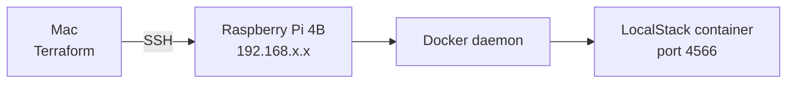

# Pi LocalStack — Terraform Docker Provider

Provisions a [LocalStack](https://localstack.cloud) container on a remote Raspberry Pi 4B using Terraform's [`kreuzwerker/docker`](https://registry.terraform.io/providers/kreuzwerker/docker/latest/docs) provider over SSH.

No manual Docker commands. No docker compose. Infrastructure as code end to end.

---

## What this provisions

| Resource | Description |
|---|---|
| `docker_image` | Pulls `localstack/localstack:latest` onto the Pi |
| `docker_volume` | Named volume for LocalStack data persistence |
| `docker_container` | LocalStack container with port bindings and environment config |

## Architecture



Terraform connects to the Pi's Docker daemon via SSH — no unencrypted TCP port exposed, no manual tunnel required.

## Prerequisites

- Terraform >= 1.12.0 on your local machine
- SSH access to the Pi with a key pair configured
- Docker running on the Pi with SSH-based daemon access enabled
- A [LocalStack](https://localstack.cloud) account and auth token

## Usage

**1. Clone the repo**
```bash
git clone git@github.com:huckbit/toolbox.git
cd toolbox/pi-localstack-docker
```

**2. Set required environment variables**
```bash
export TF_VAR_pi_host="<your-pi-ip>"
export TF_VAR_localstack_auth_token="<your-localstack-auth-token>"
```

These are never stored in any file — passed to Terraform at runtime via `TF_VAR_` prefix.

**3. Initialise and apply**
```bash
terraform init
terraform plan
terraform apply
```

**4. Verify LocalStack is healthy on the Pi**
```bash
ssh pi@<your-pi-ip> "docker ps"
```

You should see the `localstack` container with status `(healthy)`.

**5. Test the endpoint**
```bash
curl http://<your-pi-ip>:4566/_localstack/health | jq
```

**6. Tear down**
```bash
terraform destroy
```

## Variables

| Name | Description | Type | Required |
|---|---|---|---|
| `pi_host` | IP or hostname of the Raspberry Pi | `string` | yes |
| `localstack_auth_token` | LocalStack Pro auth token | `string` | yes (sensitive) |
| `localstack_version` | LocalStack image tag | `string` | no (default: `latest`) |
| `container_name` | Name of the Docker container | `string` | no (default: `localstack-main`) |
| `localstack_port` | Host port to expose LocalStack on | `number` | no (default: `4566`) |
| `aws_region` | AWS region LocalStack will emulate | `string` | no (default: `eu-west-2`) |
| `environment` | Environment name for labelling | `string` | no (default: `dev`) |
| `project` | Project name for labelling | `string` | no (default: `huckbit-localstack`) |

## Terraform concepts demonstrated

- `kreuzwerker/docker` provider with remote SSH host
- `docker_image`, `docker_container`, `docker_volume` resources
- Sensitive variable handling via `TF_VAR_` environment variables
- Named volume vs host path volume mounts
- Container healthcheck configuration
- Resource dependencies via implicit references (`docker_image.localstack.image_id`)
- Variable validation blocks

## Security notes

- Docker daemon is accessed exclusively over SSH — no TCP port 2375 exposed externally
- Auth token passed via environment variable, never committed to source control
- `.gitignore` excludes all state files, `.terraform/` directory, and `.env` files