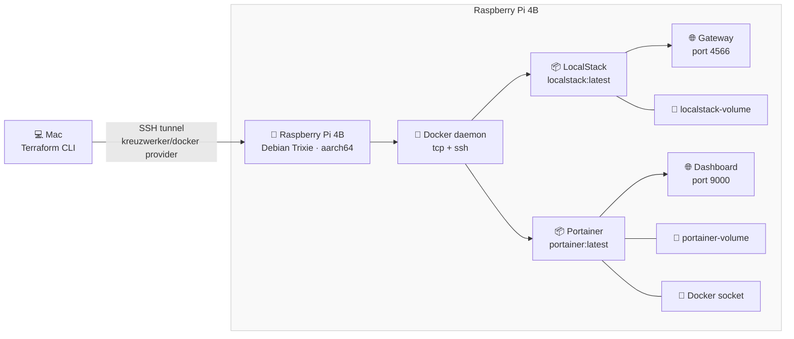

# Pi Services — Terraform Docker Provider


Provisions containerized services on a remote Raspberry Pi 4B using Terraform's [`kreuzwerker/docker`](https://registry.terraform.io/providers/kreuzwerker/docker/latest/docs) provider over SSH.

No manual Docker commands. No docker compose. Infrastructure as code end to end.

---

## What this provisions

Two independent Terraform configurations for deploying services on the Pi:

### LocalStack (`terraform/localstack/`)
| Resource | Description |
|---|---|
| `docker_image` | Pulls `localstack/localstack:latest` onto the Pi |
| `docker_volume` | Named volume for LocalStack data persistence |
| `docker_container` | LocalStack container with port 4566 and auth token config |

### Portainer (`terraform/portainer/`)
| Resource | Description |
|---|---|
| `docker_image` | Pulls `portainer/portainer:latest` onto the Pi |
| `docker_volume` | Named volume for Portainer data persistence |
| `docker_container` | Portainer container with port 9000 and Docker socket access |

## Architecture



Terraform connects to the Pi's Docker daemon via SSH — no unencrypted TCP port exposed, no manual tunnel required.

## Prerequisites

- Terraform >= 1.12.0 on your local machine
- SSH access to the Pi with a key pair configured
- Docker running on the Pi with SSH-based daemon access enabled
- LocalStack auth token (required for `terraform/localstack/` only)

## Usage

**1. Clone the repo**
```bash
git clone git@github.com:huckbit/pi-localstack-docker.git
cd pi-localstack-docker
```

**2. Provision LocalStack (optional)**
```bash
cd terraform/localstack
export TF_VAR_pi_host="<your-pi-ip>"
export TF_VAR_localstack_auth_token="<your-localstack-auth-token>"
terraform init
terraform plan
terraform apply
```

**3. Provision Portainer (optional)**
```bash
cd terraform/portainer
export TF_VAR_pi_host="<your-pi-ip>"
terraform init
terraform plan
terraform apply
```

**4. Verify services on the Pi**
```bash
ssh pi@<your-pi-ip> "docker ps"
```

You should see both `localstack` and `portainer` containers with status `(healthy)` or `(running)`.

**5. Access services**
- **LocalStack**: `curl http://<your-pi-ip>:4566/_localstack/health | jq`
- **Portainer**: Open `http://<your-pi-ip>:9000` in your browser

**6. Tear down (from each service directory)**
```bash
terraform destroy
```

## Variables

### Common variables (both services)

| Name | Description | Type | Required |
|---|---|---|---|
| `pi_host` | IP or hostname of the Raspberry Pi | `string` | yes |

### LocalStack variables (`terraform/localstack/`)

| Name | Description | Type | Required |
|---|---|---|---|
| `localstack_auth_token` | LocalStack Pro auth token | `string` | yes (sensitive) |

### Portainer variables (`terraform/portainer/`)

No additional variables required beyond `pi_host`.

## Terraform concepts

- `kreuzwerker/docker` provider connecting to a remote Docker host via SSH
- `docker_image`, `docker_container`, `docker_volume` resources
- Named volume vs host path volume mounts
- Resource dependencies via implicit references (`docker_image.image_id`)
- Variable validation blocks
- Sensitive variable handling via `TF_VAR_` environment variables

## Security notes

- Docker daemon accessed exclusively over SSH — no unencrypted TCP port exposed
- Sensitive values passed via environment variables, never committed to source control
- `.gitignore` excludes all state files and `.terraform/` directory